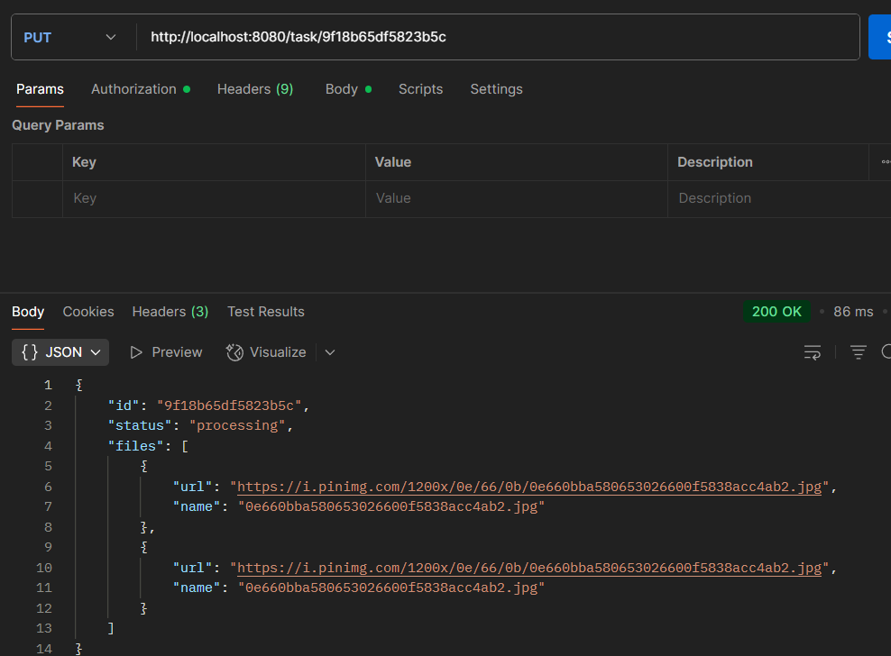

# Тестовое задание

API сервис для обработки файлов и создания архивов

## Установка и запуск

### Склонирование проекта
```bash
   git clone https://github.com/nUc1eaAr-gampRUS545/testovoe_16.07.2025.git
   cd testovoe_16.07.2025
```

### Установка зависимостей
В корне проекта (как и все команды) запустите скрипт:
```bash
   go mod download
```

### Настройка переменных окружения
Создайте файл `.env` с следующими переменными:
```
PORT=:8080
MAX_FILES=3
MAX_CONCURRENT_TASKS=3
```
### Сборка приложения 
```bash
   go build cmd/main.go
```
### Запуск приложения
```bash
   go run cmd/main.go
```

## API Endpoints

### Создание новой задачи
```bash
   POST /task/
```
Пример запроса:
```json
{}
```
Пример ответа:


### Добавление картинок к задаче
```bash
   PUT /task/{id}
```
Пример запроса:
```json
{
  "urls": [
    "https://i.pinimg.com/1200x/0e/66/0b/0e660bba580653026600f5838acc4ab2.jpg"
  ]
}
```
Пример ответа:  
  
После того, как вы добавите 3 файла автоматически создасться .zip архив с этими картинками  
### Получение статуса задачи
```bash
   GET /tasks/{id}
```
Пример ответа:  
  
## Поддерживаемые форматы файлов
- .pdf
- .jpg

## Ограничения
- Максимальное количество файлов в одной задаче: 3
- Максимальное количество одновременных задач: 3

## Практики и методолгии при проектировании сервиса

1. Модульная архитектура (Separation of Concerns)
   Четкое разделение на пакеты (handlers, services, models, configs)
- Разделение ответственности между слоями:

- HTTP-обработчики

- Бизнес-логика

- Модели данных

2. Принципы SOLID
- Single Responsibility: Каждый компонент отвечает за одну задачу

- Dependency Inversion: Использование интерфейсов

- Open-Closed: Архитектура позволяет расширять функционал без изменения существующего кода

3. Идиоматичный Go-код
Следование стандартным практикам Go:

- Возврат ошибок вместо исключений

- Использование sync.Mutex для потокобезопасности

4. Concurrency Patterns
   Использование горутин для параллельной загрузки файлов

- Синхронизация через sync.WaitGroup и sync.Mutex

- Каналы (неявно через http.Client)

5. REST API Design
- Семантичные HTTP-методы (POST, GET, PUT)

- Ресурсо-ориентированные URL (/task, /task/{id})

- Стандартные коды ответов (200, 400, 404)

6. Конфигурирование через структуры
   Централизованная конфигурация в Config

- Возможность легкого изменения параметров

7. Middleware Approach
- Цепочка middleware для обработки запросов (CORS, логирование)

8. Error Handling
- Детализированная обработка ошибок на всех уровнях

- Возврат структурированных ошибок клиенту

9. Stateless Design
- Сервер не хранит состояние между запросами (кроме активных задач)

- Идемпотентность операций
